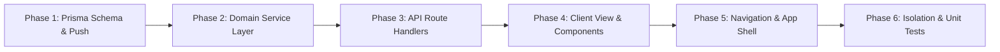
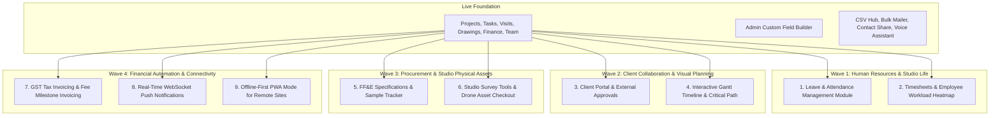

# 100% DESIGN Studio OS — Master Project Specification & Expansion Blueprint

**Project Name:** 100% DESIGN Studio OS (`miniEmployeeManagementSoftware`)  
**Domain:** Multi-Tenant Architecture, Interior Design & Employee Operations Management Platform  
**Current Version:** `1.1.0` (Production-Ready — Core Modules, Custom Fields, Voice Engine & Hubs Complete)  
**Primary Repository:** `c:\Users\ASUS\Desktop\miniEmployeeManagementSoftware`  
**Target Environment:** Node.js 20+, Next.js 16 (App Router with Webpack), React 19, TypeScript 5, Tailwind CSS v4, Prisma ORM 6.4, MySQL 8.0+

---

## 1. Executive Vision & System Purpose

Architectural practices and interior design studios face distinct operational realities that generic project management tools (Jira, Asana, Monday, ClickUp) are ill-equipped to solve:

1. **Field vs. Studio Duality:** Site architects and engineers visit active construction sites where GPS accuracy fluctuates inside concrete basements or under structural steel. Operations require geofenced check-in/out verification without battery-draining continuous background tracking.
2. **Strict Revision Control for Drawings:** Architectural drawings evolve through explicit revisions ($R_0, R_1, R_2, \dots$). Approval for $R_0$ must never implicitly carry forward to $R_1$.
3. **Four-Eyes Verification (No Self-Approval):** Professional design governance requires that an architect who creates a drawing or completes a task deliverable cannot approve their own submission. Reviewer $\neq$ Submitter.
4. **Commitment vs. Incurred Expense Segregation:** Contractor quotations represent contractual commitments, not actual money paid. Mixing quotations with incurred studio expenses distorts cash flow and profitability.
5. **Multi-Partner Studio Ownership:** Design practices typically operate with co-partners. Both require full Owner permissions, independent task views, and cross-partner delegation.
6. **Multi-Tenant SaaS Foundation:** The entire architecture is built from the database schema up with logical tenant isolation (`tenantId`). Multiple studios operate securely on a shared infrastructure without data bleed.

---

## 2. Technology Stack Matrix

| Layer | Technology | Configuration / Version | Purpose |
|---|---|---|---|
| **Framework** | Next.js (App Router) | `16.3.7` (`--webpack` mode) | Hybrid SSR/CSR, route groups, layout streaming |
| **Language** | TypeScript | `5.x` (Strict mode) | End-to-end type safety |
| **UI Library** | React | `19.2.8` | Modern concurrent rendering, Server & Client Components |
| **Styling** | Tailwind CSS & PostCSS | `@tailwindcss/postcss` `^4.0` | High-performance atomic styling |
| **ORM / Database** | Prisma Client & CLI | `6.4.1` with MySQL 8.0+ | Strongly typed schema, relations, connection pooling |
| **Authentication** | `jose` + `bcryptjs` | `jose ^6.2`, `bcryptjs ^3.0` | Stateless JWTs + DB-backed revocable sessions |
| **Validation** | Zod | `^4.6.5` | Strict schema validation for API payloads & forms |
| **Icons** | Lucide React | `^1.48.0` | Clean, accessible iconography |
| **PWA & Offline** | Web Manifest + Service Worker | Native PWA (`manifest.ts`) | Installable desktop/mobile experience |
| **Testing** | Node Test Runner / Custom Harness | TypeScript test suites | Multi-tenant isolation & security verification |

---

## 3. Architectural Principles & Golden Rules

Every developer working on this codebase **must** adhere strictly to the following rules:

### 3.1 Mandatory Tenant Isolation
* Every database entity belonging to a studio must include a `tenantId String` column.
* Every database query, update, and deletion **must** explicitly filter by `tenantId: ctx.tenantId`.
* **Never** query tenant data by primary key `id` alone. Always use `where: { id, tenantId: ctx.tenantId }`.

### 3.2 Natural Key Isolation via Composite Keys
* Natural identifiers must be unique **per tenant**, not globally.
* Examples:
  * Projects: `@@unique([tenantId, code])`
  * Employees: `@@unique([tenantId, employeeId])`
  * Memberships: `@@unique([tenantId, userId])`
  * Drawing Versions: `@@unique([documentId, revision])`

### 3.3 Four-Eyes Governance (No Self-Approval)
* A task submitter or document uploader can never approve their own work.
* Server-side guards must reject review attempts where `reviewerMembershipId === creatorMembershipId` or `uploaderMembershipId`.

### 3.4 CSV Formula Injection Defense
* When generating CSV files, any cell starting with formula initiation symbols (`=`, `+`, `-`, `@`, `\t`, `\r`) must be escaped by prefixing a single quote (`'`).

### 3.5 Decimal Precision for Financials
* Never use `Float` for money. Use Prisma `Decimal(15, 2)` across budgets, fee milestones, payments, contractor quotations, and expenses.

---

## 4. Current Directory Structure & Core Modules

```
miniEmployeeManagementSoftware/
├── .env / .env.example              # Database URLs, JWT secrets, application secrets
├── prisma/
│   └── schema.prisma                # Exhaustive multi-tenant Prisma schema (30+ models)
├── scripts/
│   └── seed.ts                      # Multi-tenant studio database seed (Tenants: "100-design", "studio-alpha")
├── src/
│   ├── app/
│   │   ├── api/                     # Next.js Route Handlers (REST Endpoints)
│   │   │   ├── admin/               # Studio administration, tenant export, quotas
│   │   │   ├── auth/                # Login, logout, session verification
│   │   │   ├── consultants/         # Consultant CRUD & project linking
│   │   │   ├── contractors/         # Contractor CRUD & quotations
│   │   │   ├── csv/                 # Universal CSV import/export & template generator
│   │   │   ├── custom-fields/       # Admin Custom Field Builder (schema & values)
│   │   │   ├── drawings/            # Document upload & revision approval routes
│   │   │   ├── employees/           # Employee onboarding, next-id, status toggles
│   │   │   ├── grammar/             # Server-side grammar auto-correction fallback
│   │   │   ├── health/              # 24/7 keep-alive liveness & readiness check
│   │   │   ├── notifications/       # Notifications list, bulk notifications, mark-read
│   │   │   ├── projects/            # Project CRUD, phases, members, finance
│   │   │   ├── storage/             # Private file upload/download proxy
│   │   │   ├── tasks/               # Tasks, checklists, comments, multi-assignees, deletion
│   │   │   └── visits/              # Geofenced check-in/out, reviews, logs
│   │   ├── w/[workspaceSlug]/       # Workspace-scoped routing
│   │   │   ├── login/               # Dual-identifier login page (Employee ID / Email)
│   │   │   └── (app)/               # Authenticated App Shell with Sidebar & Topbar
│   │   │       ├── layout.tsx       # Global layout fetching TenantContext
│   │   │       ├── tasks/           # Studio & Personal Kanban, Task Grid & Details
│   │   │       ├── projects/        # Project Portfolio & Phase Breakdown
│   │   │       ├── visits/          # Site Visits & GPS Geofence Check-In Console
│   │   │       ├── drawings/        # Architectural Drawings & Revision Approvals
│   │   │       ├── finance/         # Budgets, Fee Milestones, Payments, Expenses
│   │   │       ├── team/            # Employee Directory, Next-ID, Bulk Mailer
│   │   │       ├── contractors/     # Contractor Directory, Trades & Quotations
│   │   │       ├── consultants/     # Consultant Directory & Project Assignments
│   │   │       ├── directory/       # Client Directory & Client Profiles
│   │   │       └── csv-hub/         # Studio Data Import/Export & Template Center
│   │   ├── globals.css              # Global styles & Tailwind 4 setup
│   │   └── manifest.ts              # Web Application PWA Manifest
│   ├── components/
│   │   ├── csv/                     # CsvImportExportModal with live validation & template download
│   │   ├── custom-fields/           # CustomFieldsManagerModal, DynamicFormFields, DynamicCardFields
│   │   ├── layout/                  # AppSidebar, AppTopbar, NotificationDropdown
│   │   ├── pwa/                     # PwaInstallButton, offline banner
│   │   ├── share/                   # ContactShareModal (QR, WhatsApp, vCard, Email, Copy)
│   │   ├── speech/                  # GlobalInputAssistant (Voice dictation + Grammar autocorrect)
│   │   ├── tasks/                   # TaskCard, TaskGrid, TaskAssignees, TaskPriorityBadge, StatusBadge
│   │   ├── team/                    # BulkMailModal (Leave notices, greetings, circulars)
│   │   └── ui/                      # SearchableDropdown, SearchableSelect, Modals, Badges
│   └── server/
│       ├── auth/                    # Session management, bcrypt verification, OTP
│       ├── db/                      # Global Prisma client singleton
│       ├── modules/                 # Scoped domain service layer (business logic)
│       └── tenancy/                 # TenantContext, RBAC guards, assertion helpers
└── tests/                           # Multi-tenant isolation, CSV security & test suites
```

---

## 5. Current Feature & System Inventory

| Module / Route | Client View Component | Core Functionality & Capabilities |
|---|---|---|
| `/w/[slug]/login` | `LoginPage` | Dual-identifier login: Company-scoped Employee ID or Email + Password. Secure session token cookie. |
| `/w/[slug]/tasks` | `TasksClientView` | Task creation, Kanban boards & Grid view, status transitions (5-state & expanded), multi-employee assignment (`assignedMemberIds`) with full visibility for all assigned employees via JSON array resolution, metric synchronization, checklists, activity history, four-eyes review gate, task delegation, and Owner/Admin/Creator task deletion with audit trails. |
| `/w/[slug]/projects` | `ProjectsClientView` | Project creation, phase breakdown (Concept, Schematic, DD, GFC, Handover), client/team/consultant assignment, project budgets, and custom fields. |
| `/w/[slug]/visits` | `VisitsClientView` | Site visit scheduling, Haversine GPS geofence check-in/out, one-active-visit concurrency lock, supervisor review, and export. |
| `/w/[slug]/drawings` | `DrawingsClientView` | Drawing register ($R_0, R_1, R_2$), private file attachment, revision approval workflow, and supersession history. |
| `/w/[slug]/finance` | `FinanceClientView` | Category-wise project budgets, client fee milestones, milestone payment logging, studio expense approvals, and contractor quotation review. |
| `/w/[slug]/team` | `TeamClientView` | Studio employee directory, automated Next-ID generator (`/api/employees/next-id`), department/designation, role adjustment, account activation/deactivation, bulk mailing, and contact sharing. |
| `/w/[slug]/contractors` | `ContractorsClientView` | Contractor directory, trade disciplines, project assignments, contractor quotation tracking per revision, and 1-click contact card sharing. |
| `/w/[slug]/consultants` | `ConsultantsClientView` | Engineering consultants (Structural, MEP, HVAC, Landscape, Lighting), scopes, project associations, and contact sharing. |
| `/w/[slug]/directory` | `DirectoryClientView` | Client directory, company names, contact info, linked projects, and contact sharing. |
| `/w/[slug]/csv-hub` | `CsvHubClientView` | Studio CSV management center: universal template download, batch CSV import with validation preview, and sanitized export with formula injection defense. |

### 5.1 Platform-Wide Innovations Already Implemented

1. **Option 2 Admin Custom Field Builder:**
   - Lets Studio Owners and Admins dynamically add custom fields across 5 core entities: **Projects**, **Tasks**, **Team**, **Contractors**, and **Consultants**.
   - Supports 6 field types: `TEXT`, `NUMBER`, `DATE`, `SELECT` (with custom options), `CHECKBOX`, and `TEXTAREA`.
   - Dynamic form rendering (`DynamicFormFields.tsx`) and card badges (`DynamicCardFields.tsx`).
   - Tenant-isolated storage via `/api/custom-fields`.

2. **Universal Voice-to-Text & Grammar Auto-Correction Engine:**
   - Real-time speech recognition attached to every input/textarea in the app.
   - Spoken punctuation commands (`"period"`, `"comma"`, `"new line"`, `"question mark"`, `"colon"`).
   - Domain-aware architectural autocorrect (e.g., `cad` $\rightarrow$ `CAD`, `mep` $\rightarrow$ `MEP`, `hvac` $\rightarrow$ `HVAC`, `boq` $\rightarrow$ `BOQ`, `gfc` $\rightarrow$ `GFC`, `r0` $\rightarrow$ `R0`).
   - Global shortcuts: <kbd>Ctrl+Shift+V</kbd> (Dictation) and <kbd>Ctrl+Shift+G</kbd> (Grammar Auto-fix).

3. **Universal 1-Click Contact Share Engine (`ContactShareModal`):**
   - Instant sharing for Employees, Contractors, Consultants, and Clients.
   - Outputs: Downloadable `.vcf` vCard, direct WhatsApp messaging link, pre-formatted mailto link, live QR code display, and formatted text clipboard copy.

4. **Bulk Email & Studio Notices Engine (`BulkMailModal`):**
   - Studio broadcast center for sending personalized emails to the entire team or filtered departments.
   - Templates for Leave & Holiday notices, festive greetings, studio circulars, credential dispatches, and custom announcements.
   - Dynamic token substitution (`{name}`, `{employeeId}`, `{department}`).

5. **Universal CSV Import / Export Engine (`CsvImportExportModal`):**
   - Sample CSV template generation with example rows.
   - Client-side CSV parsing, validation, and schema mapping.
   - Automated formula injection sanitization on all exports.

6. **24/7 Keep-Alive Health Monitoring Endpoint:**
   - Lightweight `/api/health` route returning server uptime, database connectivity status, and memory stats for external uptime pingers (e.g., CronJob, UptimeRobot).

---

## 6. How to Add New Features & Modules (Step-by-Step Guide)

Follow this standardized 6-phase lifecycle to implement any new functionality cleanly, securely, and consistently:



### Phase 1: Database Schema Expansion (`prisma/schema.prisma`)
1. Create your new model ensuring **mandatory `tenantId`** and the relation back to `Tenant`:
   ```prisma
   model LeaveRequest {
     id          String      @id @default(uuid())
     tenantId    String
     tenant      Tenant      @relation(fields: [tenantId], references: [id], onDelete: Cascade)
     employeeId  String
     employee    Employee    @relation(fields: [employeeId], references: [id], onDelete: Cascade)
     leaveType   String      @db.VarChar(50) // CASUAL, SICK, EARNED, UNPAID
     startDate   DateTime
     endDate     DateTime
     totalDays   Decimal     @db.Decimal(4, 1)
     reason      String      @db.Text
     status      String      @default("PENDING") @db.VarChar(50) // PENDING, APPROVED, REJECTED
     reviewerId  String?
     reviewedAt  DateTime?
     reviewNote  String?     @db.Text
     createdAt   DateTime    @default(now())
     updatedAt   DateTime    @updatedAt

     @@index([tenantId, employeeId, status])
     @@index([tenantId, startDate, endDate])
     @@map("leave_requests")
   }
   ```
2. Add the inverse relation to the parent model (e.g., `leaveRequests LeaveRequest[]` on `Tenant` and `Employee`).
3. Apply schema updates to the database:
   ```bash
   npm run db:push
   npm run db:generate
   ```

### Phase 2: Domain Service Layer (`src/server/modules/<module-name>/`)
1. Encapsulate all database queries and business logic inside a dedicated service file.
2. Require `TenantContext` as the first argument in every function.
3. Enforce tenant isolation in every query:
   ```typescript
   import { prisma } from "@/server/db/client";
   import { TenantContext } from "@/server/tenancy/context";

   export async function listLeaveRequests(ctx: TenantContext, employeeId?: string) {
     return prisma.leaveRequest.findMany({
       where: {
         tenantId: ctx.tenantId, // MANDATORY TENANT GUARD
         ...(employeeId ? { employeeId } : {}),
       },
       include: {
         employee: {
           include: { membership: { include: { user: true } } },
         },
       },
       orderBy: { createdAt: "desc" },
     });
   }
   ```

### Phase 3: API Route Handler (`src/app/api/<route>/route.ts`)
1. Resolve and authenticate tenant context via `resolveTenantContextFromRequest(req)`.
2. Validate incoming payloads with Zod schemas.
3. Implement permission checks using `ctx.role`:
   ```typescript
   import { NextRequest, NextResponse } from "next/server";
   import { resolveTenantContextFromRequest } from "@/server/auth/service";
   import { z } from "zod";
   import { createLeaveRequest } from "@/server/modules/leave/service";

   const CreateLeaveSchema = z.object({
     leaveType: z.enum(["CASUAL", "SICK", "EARNED", "UNPAID"]),
     startDate: z.string().datetime(),
     endDate: z.string().datetime(),
     totalDays: z.number().min(0.5),
     reason: z.string().min(5).max(1000),
   });

   export async function POST(req: NextRequest) {
     try {
       const ctx = await resolveTenantContextFromRequest(req);
       if (!ctx) return NextResponse.json({ error: "Unauthorized" }, { status: 401 });

       const body = await req.json();
       const data = CreateLeaveSchema.parse(body);

       const result = await createLeaveRequest(ctx, data);
       return NextResponse.json({ success: true, data: result });
     } catch (err: any) {
       return NextResponse.json({ error: err.message }, { status: 400 });
     }
   }
   ```

### Phase 4: Create Next.js Server Page & Client View
1. Server Page: `src/app/w/[workspaceSlug]/(app)/<module>/page.tsx`
   - Server Component receiving params `{ workspaceSlug }`.
   - Renders the interactive client view.
2. Client View: `src/app/w/[workspaceSlug]/(app)/<module>/<Module>ClientView.tsx`
   - Marked `"use client"`.
   - Responsive layout, Lucide icons, search/filter bars, creation dialogs, and toast notifications.

### Phase 5: Register in Sidebar Navigation (`src/components/layout/AppSidebar.tsx`)
1. Add the route to `navItems` array with an appropriate Lucide icon and optional role guards:
   ```typescript
   {
     name: "Leave & Attendance",
     href: `/w/${context.tenantSlug}/leave`,
     icon: CalendarCheck,
   }
   ```

### Phase 6: Automated Test Verification (`tests/`)
1. Write a test ensuring that Tenant B cannot access, modify, or approve items from Tenant A.
2. Run test suites:
   ```bash
   npm run test
   ```

---

## 7. Upcoming Expansion Roadmap & Feature Blueprints

The following feature blueprints represent prioritized expansions ready for immediate development:



---

### 7.1 Feature Blueprint 1: Leave & Attendance Management Module
* **Objective:** Allow employees to apply for leave (Sick, Casual, Earned, Unpaid), view leave balances, and allow Owners/Admins to approve or reject requests with calendar visualization.
* **Suggested Route:** `/w/[workspaceSlug]/leave`
* **Key Components:**
  * **Leave Application Modal:** Date range picker, leave type selector, half-day/full-day toggle, reason input.
  * **Studio Leave Calendar:** Monthly calendar showing who is out of office, preventing scheduling conflicts during site visits and milestone deadlines.
  * **Leave Balances Card:** Casual Leave (CL), Sick Leave (SL), Earned Leave (EL) remaining vs used.
  * **Approval Inbox:** Dedicated view for Owners and Project Managers to approve/reject pending requests with review comments.
  * **Integration with Bulk Mailer:** Auto-trigger `LEAVE_NOTICE` emails when approved.
* **Database Models to Add:**
  * `LeaveRequest`: `tenantId`, `employeeId`, `leaveType`, `startDate`, `endDate`, `totalDays`, `reason`, `status`, `reviewerId`.
  * `LeaveBalance`: `tenantId`, `employeeId`, `year`, `casualRemaining`, `sickRemaining`, `earnedRemaining`.

---

### 7.2 Feature Blueprint 2: Timesheets & Employee Workload Management
* **Objective:** Track billable and non-billable architectural hours per project, monitor architect burnout, and approve weekly timesheets.
* **Suggested Route:** `/w/[workspaceSlug]/timesheets`
* **Key Components:**
  * **Weekly Grid Entry:** Log hours against project, phase, and task with notes.
  * **Partner/Manager Approval View:** Weekly batch review (Pending / Approved / Rejected).
  * **Workload Heatmap:** Visual representation of team allocation (overloaded vs available architects).
* **Database Models to Add:**
  * `Timesheet`: `tenantId`, `employeeId`, `weekStartDate`, `status` (`DRAFT`, `SUBMITTED`, `APPROVED`).
  * `TimesheetEntry`: `timesheetId`, `projectId`, `phaseId`, `taskId`, `date`, `hours`, `isBillable`, `notes`.

---

### 7.3 Feature Blueprint 3: Client Portal & External Approvals
* **Objective:** Give architectural clients a secure, branded external login or magic-link portal to view design progress, review drawing revisions, and formally sign off on milestones.
* **Suggested Route:** `/w/[workspaceSlug]/client-portal` (or `/portal/[clientToken]`)
* **Key Components:**
  * **Project Progress Dashboard:** Phase completion status and upcoming milestones.
  * **Drawing Revision Gallery:** High-resolution PDF previewer with revision selector ($R_0, R_1, \dots$).
  * **Client Sign-Off Dialog:** Formal "Approve / Request Revisions" digital signature box storing timestamp, IP address, and client feedback.
  * **Financial Overview:** Completed fee milestones, issued invoices, and payment receipts.
* **Database Models to Add:**
  * `ClientPortalUser`: `tenantId`, `clientId`, `email`, `passwordHash`, `lastLoginAt`.
  * `ClientApprovalLog`: `tenantId`, `documentVersionId`, `clientUserId`, `ipAddress`, `decision`, `comments`.

---

### 7.4 Feature Blueprint 4: Interactive Gantt Chart & Milestone Timeline
* **Objective:** Visual interactive scheduling engine showing project phases, milestone target dates, critical paths, and task dependencies.
* **Suggested Route:** `/w/[workspaceSlug]/projects/[projectId]/timeline`
* **Key Components:**
  * Interactive SVG/Canvas Gantt chart (zoom by day, week, month).
  * Drag-and-drop phase date adjustments with auto-dependency shifting.
  * Milestone markers (Client approval, Municipal submission, Tender issue, Site handover).
  * Baseline vs Actual progress comparison bars.

---

### 7.5 Feature Blueprint 5: FF&E Specification & Material Sample Library
* **Objective:** Manage Furniture, Fixtures & Equipment (FF&E), material finishes (tiles, veneers, hardware, sanitary ware), vendor quotes, and physical sample approvals.
* **Suggested Route:** `/w/[workspaceSlug]/materials`
* **Key Components:**
  * Material boards organized by room or zone (e.g., Master Bedroom, Reception Lobby, Façade).
  * Specification sheets: Brand, Model, Finish, Unit Rate, Vendor contact, Lead time.
  * Sample approval tracking: Sample Requested $\rightarrow$ Received at Studio $\rightarrow$ Client Approved $\rightarrow$ Ordered.
* **Database Models to Add:**
  * `MaterialCategory`: Flooring, Wall Finishes, Lighting, Hardware, Plumbing, Fabrics.
  * `MaterialItem`: Brand, code, specs, unit cost, preferred vendor ID, photo attachment.
  * `ProjectMaterialSpec`: `projectId`, `materialItemId`, `roomLocation`, `quantity`, `approvalStatus`.

---

### 7.6 Feature Blueprint 6: Studio Equipment & Tool Asset Checkout
* **Objective:** Manage shared architectural tools: Total Station laser distance meters, drone cameras, VR headsets, lux meters, and sample suitcases.
* **Suggested Route:** `/w/[workspaceSlug]/assets`
* **Key Components:**
  * Asset catalog with serial numbers, condition status, and calibration dates.
  * Quick Check-Out / Check-In workflow for site visits.
  * Maintenance schedule reminders and damage logs.
* **Database Models to Add:**
  * `StudioAsset`: `tenantId`, `name`, `serialNumber`, `category`, `status` (`AVAILABLE`, `CHECKED_OUT`, `IN_MAINTENANCE`).
  * `AssetCheckoutLog`: `tenantId`, `assetId`, `employeeId`, `checkedOutAt`, `expectedReturnAt`, `returnedAt`, `conditionNotes`.

---

### 7.7 Feature Blueprint 7: Automated GST Invoicing & Tax Ledger
* **Objective:** Convert completed fee milestones into downloadable GST-compliant PDF tax invoices with automated payment tracking.
* **Suggested Route:** `/w/[workspaceSlug]/finance/invoices`
* **Key Components:**
  * One-click "Generate Invoice" from approved `FeeMilestone`.
  * Customizable invoice layout: Studio logo, GSTIN, client billing address, SAC/HSN codes (e.g., 998321 for Architectural Services).
  * Payment status tracking (Unpaid, Overdue, Partially Paid, Settled).
  * Automated email reminders for pending milestone dues.

---

### 7.8 Feature Blueprint 8: Real-Time WebSocket Push Notifications
* **Objective:** Replace manual polling and page reloads with instant in-app alerts for critical studio events.
* **Events to Stream:**
  * Task assignment or new task comment.
  * Architect checks in at a construction site.
  * Contractor submits a revised quotation.
  * Drawing revision approved or rejected.
* **Architecture:** Server-Sent Events (SSE) or WebSockets via Next.js route handler connecting to existing `Notification` and `NotificationOutbox` models.

---

### 7.9 Feature Blueprint 9: Offline-First PWA Mode for Remote Site Visits
* **Objective:** Enable site architects to capture notes, checklists, and photos even in basement levels or remote sites with zero connectivity.
* **Key Components:**
  * IndexedDB local queue for offline site visit check-ins and photo capture.
  * Background synchronization when network connectivity is restored.
  * Cached drawing viewer for offline review on iPad/tablet.

---

## 8. Role-Based Access Control (RBAC) Matrix

| Action / Capability | `OWNER` | `ADMIN` | `PROJECT_MANAGER` | `EMPLOYEE` |
|---|:---:|:---:|:---:|:---:|
| Studio Settings, Plan & Subscriptions | ✅ | ❌ | ❌ | ❌ |
| Manage Team Members & Roles | ✅ | ✅ | ❌ | ❌ |
| Manage Custom Fields Schema | ✅ | ✅ | ❌ | ❌ |
| Send Bulk Studio Emails | ✅ | ✅ | ❌ | ❌ |
| Create / Edit Projects & Phases | ✅ | ✅ | ✅ | View Only |
| Assign Tasks & Approve Work | ✅ | ✅ | ✅ | Self Only (No self-approval) |
| Delete Task Deliverable | ✅ | ✅ | Creator Only | Creator Only |
| Site Visit Check-in/out | ✅ | ✅ | ✅ | ✅ |
| Site Visit Supervisor Review | ✅ | ✅ | ✅ | ❌ |
| Upload Drawing Revisions | ✅ | ✅ | ✅ | ✅ |
| Approve Drawing Revisions | ✅ | ✅ | ✅ | ❌ |
| Manage Budgets, Milestones & Expenses | ✅ | ✅ (or with flag) | ❌ | ❌ |
| Contractor Quotation Acceptance | ✅ | ✅ | ✅ | ❌ |
| CSV Data Hub Import / Export | ✅ | ✅ | View Only | ❌ |
| Apply for Leave | ✅ | ✅ | ✅ | ✅ |
| Approve / Reject Leave Requests | ✅ | ✅ | ✅ (assigned team) | ❌ |

---

## 9. Development & Operational Commands

### 9.1 Local Development
```bash
# Start Next.js development server with webpack
npm run dev

# Open workspace in browser:
# http://localhost:3000/w/100-design/login
```

### 9.2 Database Operations
```bash
# Push schema updates to MySQL without data loss
npm run db:push

# Re-generate Prisma Client types after schema changes
npm run db:generate

# Re-seed database with default studios (100% DESIGN & Studio Alpha)
npm run db:seed
```

### 9.3 Quality & Test Verification
```bash
# Run multi-tenant isolation and security test suite
npm run test

# Run all automated test suites
npm run test:all

# Production build verification
npm run build
```

---

## 10. Seed Workspaces & Default Accounts

The following credentials are generated by `scripts/seed.ts` for local development and testing:

### Workspace 1: `100-design` (100% DESIGN Studio)
* **Co-Owner / Partner 1:**
  * Employee ID: `EMP-001` (or email: `owner@100percentdesign.com`)
  * Role: `OWNER`
  * Password: `Password123!`
* **Co-Owner / Partner 2:**
  * Employee ID: `EMP-002` (or email: `partner@100percentdesign.com`)
  * Role: `OWNER`
  * Password: `Password123!`
* **Project Manager:**
  * Employee ID: `EMP-003` (or email: `pm@100percentdesign.com`)
  * Role: `PROJECT_MANAGER`
  * Password: `Password123!`
* **Site Architect / Employee:**
  * Employee ID: `EMP-004` (or email: `architect@100percentdesign.com`)
  * Role: `EMPLOYEE`
  * Password: `Password123!`

### Workspace 2: `studio-alpha` (Studio Alpha Design Partners)
* **Owner:**
  * Employee ID: `ALPHA-001` (or email: `owner@studioalpha.com`)
  * Role: `OWNER`
  * Password: `Password123!`

---

## 11. Quick Expansion Checklist

When starting work on any new feature:
1. [ ] Check existing models in [`prisma/schema.prisma`](file:///c:/Users/ASUS/Desktop/miniEmployeeManagementSoftware/prisma/schema.prisma) to avoid redundant tables.
2. [ ] Follow the **6-Phase Implementation Guide** in Section 6.
3. [ ] Verify that every query includes `tenantId: ctx.tenantId`.
4. [ ] Ensure no submitter can approve their own deliverable (Four-Eyes Gate).
5. [ ] Register the new module in [`AppSidebar.tsx`](file:///c:/Users/ASUS/Desktop/miniEmployeeManagementSoftware/src/components/layout/AppSidebar.tsx) if a top-level page is added.
6. [ ] Add test cases to [`tests/`](file:///c:/Users/ASUS/Desktop/miniEmployeeManagementSoftware/tests) and verify with `npm run test`.
