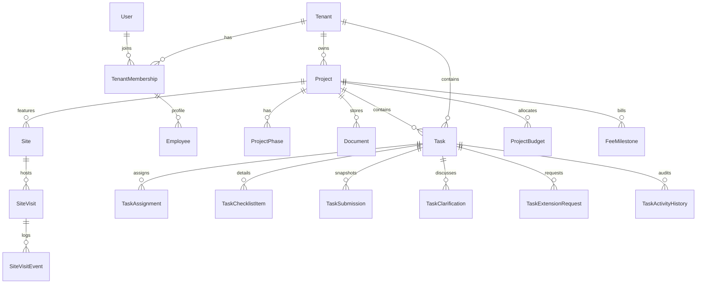
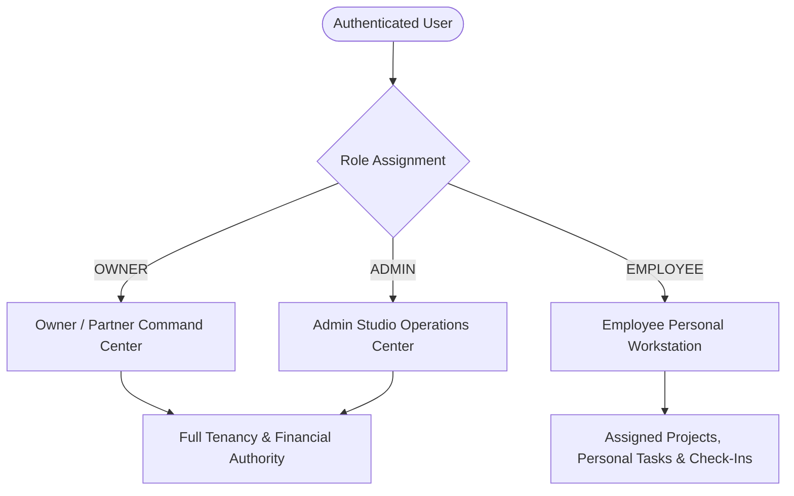
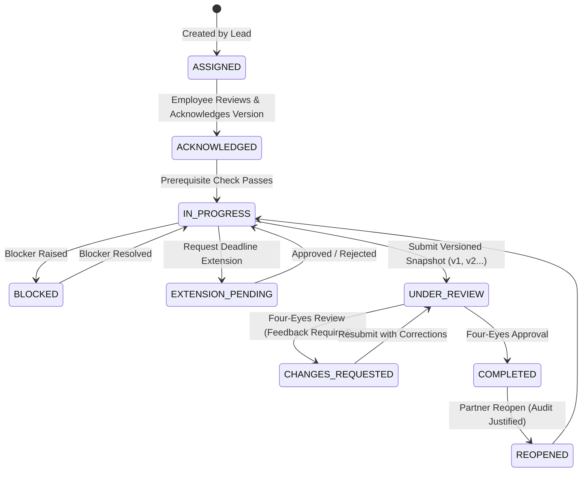

# 100% DESIGN Studio OS — Master Project Specification & Architecture Manual

**Project Name:** 100% DESIGN Studio OS (`miniEmployeeManagementSoftware`)  
**Domain:** Multi-Tenant Architecture, Interior Design & Employee Operations Platform  
**Current Version:** `2.5.0` (Production Enterprise Ready — Multi-Tenant Architecture OS, Ultra-Production Personal Workstation, End-to-End Governed Task Workflow Lifecycle, Four-Eyes Quality Gates, & Field Geolocation Inspection Protocol)  
**Primary Repository:** `c:\Users\ASUS\Desktop\miniEmployeeManagementSoftware`  
**Target Environment:** Node.js 20+, Next.js 16 (App Router with Webpack mode), React 19, TypeScript 5 (Strict), Tailwind CSS v4, Prisma ORM 6.4, MySQL 8.0+

---

## 1. Executive Vision & System Purpose

Architectural practices and interior design studios operate under distinct operational workflows that generic project management suites (Jira, Asana, Monday, ClickUp) cannot satisfy without awkward workarounds:

1. **Field vs. Studio Duality:** Site architects and project engineers constantly move between studio drafting tables and active construction sites where GPS accuracy fluctuates inside concrete basements or under steel structures. Operations require rapid geofenced check-in/out verification without battery-draining continuous background tracking.
2. **Strict Revision Control for Drawings:** Architectural drawings evolve through explicit, immutable revisions ($R_0, R_1, R_2, \dots$). Approval for $R_0$ must never implicitly carry forward to $R_1$.
3. **Four-Eyes Quality Gates (No Self-Approval):** Professional design governance requires that an architect or engineer who creates a drawing, delivers a specification, or submits a task deliverable cannot approve their own submission. Reviewer $\neq$ Submitter.
4. **Governed Deliverable & Task Lifecycle:** Deliverables contain multiple checklist items assigned across different team members. Items progress through a rigorous 8-stage lifecycle: Assignment $\to$ Versioned Acknowledgement $\to$ Dependency-Checked Start $\to$ Clarification / Blocker Handling $\to$ Deadline Extension Gate $\to$ Versioned Snapshot Submission $\to$ Four-Eyes Review & Requested Changes $\to$ Automatic Deliverable Completion & Leadership-Only Reopen.
5. **Commitment vs. Incurred Expense Segregation:** Contractor quotations represent contractual commitments, not actual money disbursed. Mixing contractor bids with incurred studio expenses distorts cash flow and profitability.
6. **Multi-Partner Studio Ownership:** Design practices typically operate with co-partners. Both require full Owner permissions, independent task views, and cross-partner delegation without administrative hierarchy collisions.
7. **Enterprise Field Geolocation & Inspection Protocol:** On-site inspection logs must capture tamper-evident GPS coordinates, reverse-geocoded human locality addresses, configurable site perimeter boundaries, photographic evidence tagged by severity, snagging/defect registers, contractor acknowledgments, and print-ready official inspection audit certificates.
8. **Multi-Tenant SaaS Foundation:** The entire architecture is built from the database schema up with logical tenant isolation (`tenantId`). Multiple studios operate securely on shared infrastructure with zero data bleed.

---

## 2. Technology Stack Matrix

| Layer | Technology | Version / Configuration | Purpose |
|---|---|---|---|
| **Framework** | Next.js (App Router) | `16.3.7` (`--webpack` mode) | Hybrid SSR/CSR, route groups, layout streaming, Server Actions |
| **Language** | TypeScript | `5.x` (Strict Mode) | End-to-end type safety across database, services, APIs, and client views |
| **UI Library** | React | `19.2.8` | Concurrent rendering, Server Components, client state hooks |
| **Styling** | Tailwind CSS & PostCSS | `@tailwindcss/postcss` `^4.0` | Modern CSS-first atomic styling, CSS variables, dark/light accents |
| **ORM / Database** | Prisma Client & CLI | `6.4.1` with MySQL 8.0+ | Strongly typed relational schema, migrations, connection pooling |
| **Authentication** | `jose` + `bcryptjs` | `jose ^6.2`, `bcryptjs ^3.0` | Stateless JWT tokens + DB-backed revocable sessions with role checks |
| **Validation** | Zod | `^4.6.5` | Strict schema validation for all API request bodies and query parameters |
| **Icons** | Lucide React | `^1.48.0` | Consistent, accessible architectural and operations iconography |
| **PWA & Offline** | Web Manifest + Service Worker | Native PWA (`manifest.ts`) | Installable desktop and mobile app experience |
| **Speech & Audio** | Web Speech API | Custom Speech-to-Text Engine | Hands-free on-site observation dictation with domain terminology support |
| **Geofencing & Mapping** | Haversine Formula + SVG Spatial Plot + OpenStreetMap | Custom Math Engine + Vector Canvas | Mathematical great-circle distance calculation, in-app boundary plots, reverse-geocoding |
| **Testing** | Node.js Test Runner + `tsx` | Native `node:test` + `node:assert` | Multi-tenant isolation, security, and full workflow integration tests |

---

## 3. Architectural Principles & Golden Governance Rules

Every developer and engineer working on this codebase **must** adhere strictly to the following rules:

### 3.1 Mandatory Tenant Isolation
* Every database entity belonging to a studio includes a `tenantId String` foreign key.
* Every database query, mutation, and deletion **must** explicitly filter by `tenantId: ctx.tenantId`.
* **Never** query tenant records by primary key `id` alone. Always use `where: { id, tenantId: ctx.tenantId }`.

### 3.2 Natural Key Isolation via Composite Unique Indexes
* Natural identifiers must be unique **per tenant**, not globally across the entire database:
  * Projects: `@@unique([tenantId, code])`
  * Employees: `@@unique([tenantId, employeeId])`
  * Memberships: `@@unique([tenantId, userId])`
  * Drawing Versions: `@@unique([documentId, revision])`
  * Task Assignments: `@@unique([taskId, membershipId])`
  * Site Visit Events: `@@unique([tenantId, idempotencyKey])`

### 3.3 Four-Eyes Governance (No Self-Approval)
* A task submitter or document uploader can **never** approve their own work.
* Server-side guards reject review attempts where `reviewerMembershipId === creatorMembershipId` or `submitterMembershipId`.
* When creating deliverables with a designated reviewer, the reviewer cannot be in the deliverable's assignee list.

### 3.4 CSV Formula Injection Defense
* When generating or exporting CSV files, any cell starting with formula initiation symbols (`=`, `+`, `-`, `@`, `\t`, `\r`) must be escaped by prefixing a single quote (`'`).

### 3.5 Exact Decimal Precision for Financials
* Never use `Float` for money. Use Prisma `Decimal(15, 2)` across budgets, fee milestones, milestone payments, contractor quotations, and studio expenses.

### 3.6 Geofence & Concurrency Locks
* Site visit check-ins calculate the great-circle distance to the project's configured coordinates using the Haversine formula.
* An employee can have at most **one active checked-in visit** at any time. Opening a new visit requires completing or closing previous active visits.

---

## 4. Master Database Schema Specification (Prisma Data Dictionary)

The database schema (`prisma/schema.prisma`) contains 34 models organized across 9 functional domains:



### 4.1 Tenancy & Identity Models
* **`Tenant`**: Root tenant container (`slug`, `name`, `timezone`, `currency`, `branding`, `lifecycleState`).
* **`User`**: Global user entity (`email`, `passwordHash`, `fullName`, `accountState`).
* **`TenantMembership`**: Tenant-scoped user association (`tenantId`, `userId`, `role`: `OWNER`, `ADMIN`, `PROJECT_MANAGER`, `EMPLOYEE`, `isActive`).
* **`Employee`**: Official HR profile (`employeeId`, `designation`, `department`, `joinDate`, `emergencyContact`).
* **`TenantInvitation`**: Tokenized invite workflow (`email`, `role`, `token`, `expiresAt`, `status`).

### 4.2 Project & Client Management
* **`Client`**: Studio client record (`name`, `company`, `email`, `contact`, `address`, `notes`).
* **`Consultant`**: Specialized consultants (`name`, `firmName`, `discipline`: Structural, MEP, HVAC, Landscape, Lighting, Acoustics, `contact`, `email`).
* **`Contractor`**: Commissioned trades (`name`, `firmName`, `trade`: Civil/Masonry, Electrical, Carpentry, Plumbing, Painting, `contact`, `email`).
* **`Project`**: Master architectural project entity (`code`, `name`, `projectType`, `status`: `DRAFT`, `PLANNING`, `ACTIVE`, `ON_HOLD`, `COMPLETED`, `CANCELLED`, `ARCHIVED`, `brief`, `startDate`, `targetDate`, `budget`, `currency`).
* **`ProjectMember`**: Project team roster junction (`projectId`, `membershipId`, `projectRole`).
* **`ProjectPhase`**: Structured architectural phases (`phaseName`, `sortOrder`, `plannedStartDate`, `plannedEndDate`, `status`).
* **`ProjectMilestone`**: Non-financial delivery milestones (`title`, `targetDate`, `status`: `PENDING`, `ACHIEVED`, `MISSED`, `isClientSignoffRequired`).
* **`ProjectConsultant`** & **`ProjectContractor`**: Relational junction models for project assignments.
* **`Quotation`**: Contractor price bids (`quotationNumber`, `revision`, `amount`, `status`: `DRAFT`, `SUBMITTED`, `ACCEPTED`, `REJECTED`).
* **`ProjectChangeRequest`**: Formal scope/budget change control (`title`, `reason`, `scheduleImpactDays`, `feeImpactAmount`, `status`).

### 4.3 Governed Task & Deliverable Workflow
* **`Task`**: Governed architectural deliverable (`title`, `description`, `priority`: `LOW`, `MEDIUM`, `HIGH`, `URGENT`, `status`: `NOT_STARTED`, `TODO`, `STARTED`, `IN_PROGRESS`, `CHECKING`, `IN_REVIEW`, `COMPLETED`, `BLOCKED`, `CANCELLED`).
* **`TaskAssignment`**: Employee assignment junction (`taskId`, `membershipId`, `acknowledgedAt`, `acknowledgedVersion`, `isCompleted`).
* **`TaskChecklistItem`**: Sub-deliverable checklist items (`item`, `assignedMemberId`, `prerequisiteItemId`, `status`: `PENDING`, `IN_PROGRESS`, `COMPLETED`, `isCompleted`).
* **`TaskSubmission`**: Versioned snapshot submission (`version`, `summary`, `checklistTaskIds`, `criteriaSnapshot`, `evidenceFiles`, `evidenceLinks`, `status`: `PENDING`, `APPROVED`, `CHANGES_REQUESTED`, `reviewFeedback`).
* **`TaskClarification`**: Threaded Q&A clarification messages between assignees and leadership.
* **`TaskExtensionRequest`**: Formal deadline extension gate (`requestedDueDate`, `reason`, `status`, `decidedAt`).
* **`TaskActivityHistory`**: Immutable chronological activity stream (`action`, `actorId`, `diffPayload`).

### 4.4 Geolocation, Sites & Field Inspection Protocol
* **`Site`**: Physical construction or renovation site coordinates:
  * `id String @id @default(uuid())`
  * `tenantId String`
  * `projectId String`
  * `name String @db.VarChar(191)`
  * `address String @db.Text`
  * `latitude Float?`
  * `longitude Float?`
  * `radiusMeters Float @default(150.0)` — Configurable geofence radius (50m – 1000m)
  * `accuracyThresholdMeters Float @default(100.0)`
  * `landmarkNotes String? @db.Text` — Landmark/access gate notes
  * `googleMapsUrl String? @db.VarChar(512)` — Linked Google Maps / Plus Code URL
  * `isActive Boolean @default(true)`
* **`SiteVisit`**: Assigned site visit and comprehensive field inspection dossier:
  * `id String @id @default(uuid())`
  * `tenantId String`, `projectId String`, `siteId String`, `employeeId String`
  * `taskId String?` — Direct linkage to project deliverable
  * `milestoneId String?` — Direct linkage to delivery milestone
  * `purpose String @db.VarChar(255)`
  * `scheduledTime DateTime`
  * `operationalState SiteVisitOperationalState` (`SCHEDULED`, `ACTIVE`, `CHECKED_OUT`, `CANCELLED`)
  * `findings String? @db.Text` — Technical minutes & observations
  * `nextActions String? @db.Text` — Follow-up directives
  * `inspectionType String? @default("ROUTINE")` (`STRUCTURAL`, `MEP`, `FINISHES`, `ROUTINE`, `CLIENT_WALKTHROUGH`, `URGENT_DEFECT`)
  * `priority String? @default("MEDIUM")` (`ROUTINE`, `MEDIUM`, `HIGH`, `CRITICAL`)
  * `checkInAddress String? @db.VarChar(255)` — Audited reverse-geocoded check-in locality
  * `checkOutAddress String? @db.VarChar(255)` — Audited reverse-geocoded check-out locality
  * `weather String? @db.VarChar(64)` — Environmental & weather conditions stamp
  * `attendeesJson Json?` — Stakeholders and contractor reps on-site
  * `checklistItemsJson Json?` — Pre-visit QA/QC verification checklist results
  * `photosJson Json?` — Geotagged photographic evidence with classification tags and GPS watermarks
  * `snagsJson Json?` — Defect register items with severity, contractor attribution, and target dates
  * `contractorSignOff Json?` — Contractor representative on-site acknowledgment and phone
  * `voiceMemoTranscript String? @db.Text` — Speech-to-text dictation transcript
  * `reviewDecision SiteVisitReviewDecision` (`PENDING`, `ACCEPTED`, `NEEDS_CLARIFICATION`, `REJECTED`)
  * `reviewComment String? @db.Text`
* **`SiteVisitEvent`**: Immutable chronological GPS telemetry events:
  * `eventType SiteVisitEventType` (`CHECK_IN`, `CHECK_OUT`, `EXCEPTION`)
  * `latitude Float?`, `longitude Float?`, `accuracyMeters Float?`, `calculatedDistanceMeters Float?`
  * `geofenceAssessment GeofenceAssessment` (`WITHIN_RADIUS`, `OUTSIDE_RADIUS`, `UNCERTAIN`, `LOCATION_UNAVAILABLE`)
  * `idempotencyKey String @unique`
  * `failureReason String? @db.Text`

### 4.5 Drawings, Documents & Approvals
* **`Document`**: Master document/drawing container (`drawingNumber`, `discipline`, `documentType`).
* **`DocumentVersion`**: Immutable revision record (`revision`: R0, R1, R2, `approvalState`: `DRAFT`, `IN_REVIEW`, `APPROVED`, `REJECTED`, `SUPERSEDED`, `issuePurpose`).
* **`ApprovalRequest`**: Formal review request linking tasks, checklist items, or drawings to reviewers.

### 4.6 Financials, Storage & System
* **`Budget`**, **`FeeMilestone`**, **`FeePayment`**, **`Expense`**: Studio cashflow and project finances.
* **`PrivateFile`**: Quarantine and scan-verified file storage.
* **`Notification`** & **`NotificationOutbox`**: In-app notifications and email outbox with exponential backoff.
* **`AuditEvent`**: Immutable security audit trail.
* **`ProfileChangeRequest`**: Employee official record change workflow.

---

## 5. User Roles, Permissions & Workstation Dashboards

The application enforces strict 3-tier Role-Based Access Control (RBAC):



### 5.1 Role Hierarchy
1. **`OWNER` (Studio Partner / Principal Architect):**
   * Equal executive authority with co-partners. Full management of projects, billing, fees, team rosters, site inspection reviews, and studio settings.
2. **`ADMIN` (Studio Director / Practice Manager):**
   * Operational management authority equal to Owner across projects, schedules, task reviews, site visit assignments, and team management.
3. **`EMPLOYEE` (Architect, Interior Designer, Site Engineer):**
   * Scoped access to assigned projects, assigned deliverable checklists, self-tasks, personal calendar, and GPS check-in/out protocols. Strictly isolated from financial budgets, billing milestones, and unassigned project data.

### 5.2 Direct Role Login Routing
Upon authentication, the login API performs immediate role detection and issues HTTP 303 redirects:
* `OWNER` $\to$ `/w/[workspaceSlug]/dashboard/owner`
* `ADMIN` $\to$ `/w/[workspaceSlug]/dashboard/admin`
* `EMPLOYEE` $\to$ `/w/[workspaceSlug]/dashboard/employee`

---

## 6. Governed Deliverable & Task Workflow Lifecycle

Deliverables in 100% DESIGN Studio OS are governed by a deterministic 8-stage lifecycle to prevent dropped handoffs and unverified construction work:



### Stage Details:
1. **Assignment:** Assigned to one or more members with structured checklist items and optional prerequisite dependencies.
2. **Versioned Acknowledgement:** Assignees must explicitly acknowledge the task version before starting work.
3. **Dependency-Checked Start:** System checks all prerequisite checklist items. Work cannot begin if any prerequisite is incomplete or circular dependencies exist.
4. **Clarification & Blocker Handling:** Assignees can raise formal blockers (halting progress until resolved) or post questions in the threaded clarification channel.
5. **Deadline Extension Gate:** Assignees can request due date extensions with documented reasons. Approval updates task deadlines atomically.
6. **Versioned Snapshot Submission:** Upon completion, the assignee submits an immutable snapshot containing summary, evidence files, external links, and checklist state.
7. **Four-Eyes Review & Requested Changes:** A designated reviewer (who cannot be the submitter) verifies the work. If deficient, mandatory change feedback is provided; the assignee resubmits as Snapshot $v_{n+1}$.
8. **Automatic Deliverable Completion & Reopen:** When all assignments and checklist items pass review, the deliverable automatically completes. Reopening a completed deliverable requires documented management justification.

---

## 7. Field Geolocation, Site Visits & Inspection Protocol (Ultra-Enterprise Architecture)

The site visit module provides an end-to-end, tamper-evident field inspection protocol designed for architectural and construction oversight:

```mermaid
flowchart LR
    A[Assign Site Visit Form] -->|Smart Location + Typology + Geofence| B[Scheduled Visit]
    B -->|1-Click GPS Check-In| C[Active On-Site Inspection]
    C -->|Photo Gallery + Snags + Speech Dictation + Checklists| D[Check-Out Submission]
    D -->|Reverse Geocoding + Sign-Off| E[Inspection Dossier Feed]
    E -->|Partner Review & Verification| F[Printable Audit Certificate PDF]
```



### 7.1 Location & Geolocation Upgrades
* **1-Click "Detect My Spot" GPS Fix:** Captures browser geolocation sensors instantly and performs reverse geocoding via OpenStreetMap Nominatim to auto-fill human locality addresses.
* **Google Maps URL / Plus Code Parser:** Regex engine (`parseGoogleMapsInput`) extracts exact latitude, longitude, and place names from formats:
  * `https://maps.google.com/?q=18.921,72.834`
  * `https://www.google.com/maps/place/.../@18.921,72.834,17z`
  * Raw coordinates: `18.921, 72.834`
* **Configurable Geofence Perimeter Radius Slider:** Custom perimeter boundaries per site (50m bungalow/apartment, 150m commercial tower, 350m residential complex, 1000m infrastructure/campus), persisted to MySQL `Site.radiusMeters`.
* **Reverse-Geocoded Locality Storage:** Automatic storage of human-readable neighborhood/locality address upon both Enter (`checkInAddress`) and Exit (`checkOutAddress`).
* **In-App Vector Spatial Map & Boundary Plot (`InspectionMapPreview.tsx`):**
  * Vector SVG canvas displaying site centroid, scaled geofence perimeter boundary circle, check-in pin, check-out pin, and multi-checkpoint GPS movement trail.
  * Interactive distance deviation meter gauge (`{dist}m / {radius}m — Inside Boundary`).
  * One-click toggle between Vector Spatial Plot and interactive OpenStreetMap tile view.

### 7.2 "Assign Site Visit" Form Upgrades
* **Inspection Typology & Scope Classification:**
  * 🏗️ **`STRUCTURAL`**: Structural Quality Audit (Rebar, shuttering, post-tensioning, cube tests).
  * 💧 **`MEP`**: Concealed MEP & Waterproofing (Plumbing pressure tests, electrical conduit, slab sleeves).
  * 🎨 **`FINISHES`**: Finishes & Interior Snagging (Tiling plumb/level, false ceilings, paintwork).
  * 📋 **`ROUTINE`**: Routine Progress Verification (Weekly contractor milestones).
  * 🤝 **`CLIENT_WALKTHROUGH`**: Client / Authority Walkthrough (Joint walkthrough with client/officer).
  * 🚨 **`URGENT_DEFECT`**: Urgent Rectification / Defect Inspection (Structural cracking, stop-work).
* **Deliverable & Milestone Linkage:** Direct association to active tasks (`taskId`) or delivery milestones (`milestoneId`). Completed reports attach as verification evidence.
* **Pre-Visit QA/QC Inspection Checklist Builder:** Dynamic checklist generator with one-click typology presets and custom item builder.
* **Site Attendees & Commissioned Contractors Tagging:** Direct selection from project contractors and consultants, external contact inputs, and 1-click WhatsApp (`https://wa.me/...`) and direct phone links.
* **Urgency & PPE Safety Advisories:** Priority levels (`ROUTINE`, `HIGH`, `CRITICAL`) and mandatory PPE banners (Hard Hat, Safety Boots, Hi-Vis Vest, Safety Harness, Protective Goggles).

### 7.3 Recent Studio Site Inspection Log & Dossier Upgrades
* **Enhanced Section 3 Table:**
  * Category Badge (color-coded with typology icons).
  * Priority chip.
  * Deliverable / Milestone Link chip.
  * Location & Distance Pill (site name, audited locality, distance deviation status).
  * Evidence Strip (photo count, snags count).
  * Full multi-facet filter bar: Search, State, Category, Project, Review Decision, and Date/Alpha sorting.
* **Geotagged Photo Evidence Gallery (`PhotoEvidenceGallery.tsx`):**
  * Up to 10 photos per inspection with categorization tags (`QUALITY_ISSUE`, `PROGRESS_PHOTO`, `APPROVED_JUNCTION`, `SAFETY_VIOLATION`), GPS watermarks, captions, and modal lightbox zoom.
* **Site Snags & Defect Flagging Register (`SnagsTracker.tsx`):**
  * Defect register tracking Title, Severity (`MINOR`, `MAJOR`, `CRITICAL`), Contractor responsible, Target rectification date, and Status (`OPEN`, `RESOLVED`).
* **Web Speech API Speech-to-Text Dictation:**
  * Embedded voice dictation button allowing architects to speak observations directly into findings minutes on site.
* **Environmental & Weather Stamp:**
  * Ambient weather condition tracking (temperature, humidity, curing suitability) stamped on inspections.
* **Contractor Site Engineer Digital Sign-Off:**
  * Representative name and phone recorded on site acknowledging technical observations.
* **Export Printable Inspection Report (`PrintableInspectionReport.tsx`):**
  * Official print-ready "Architect's Site Inspection Report & Geolocation Audit Certificate" with studio header, project details, audit table, photo gallery, snags register, and partner approval stamp.

---

## 8. Complete API Route Catalog

All API endpoints enforce tenant context validation, authentication, and role checks:

### 8.1 Authentication & Session
* `POST /api/auth/login` — Authenticates user, issues JWT token and session cookie, redirects by role.
* `POST /api/auth/logout` — Revokes session in database, clears cookie.
* `GET /api/auth/me` — Returns current tenant membership, user identity, and permissions.

### 8.2 Projects & Workspaces
* `GET /api/projects` — Lists tenant projects with role-scoped filtering.
* `POST /api/projects/create` — Creates draft or active project with atomic lead and trade associations.
* `PATCH /api/projects/[projectId]/lifecycle` — Manages hold, resume, completion, and archival states.
* `POST /api/projects/[projectId]/members` — Manages project member additions and safeguard-checked removals.
* `POST /api/projects/[projectId]/changes` — Submits and reviews project scope/budget change requests.
* `POST /api/projects/[projectId]/milestones` — Manages delivery milestones and client sign-off tracking.

### 8.3 Tasks & Deliverables
* `GET /api/tasks` — Lists deliverables for project or current user.
* `POST /api/tasks/create` — Creates deliverable with four-eyes reviewer separation and checklists.
* `POST /api/tasks/[taskId]/acknowledge` — Versioned assignment acknowledgement.
* `POST /api/tasks/[taskId]/start` — Dependency-checked work initiation.
* `POST /api/tasks/[taskId]/blocker` — Raises or resolves task blockers.
* `POST /api/tasks/[taskId]/extension` — Requests or reviews deadline extension requests.
* `POST /api/tasks/[taskId]/submit` — Submits versioned deliverable snapshot.
* `POST /api/tasks/[taskId]/review` — Four-eyes approval or change request feedback.
* `POST /api/tasks/[taskId]/reopen` — Management-justified reopen of completed deliverables.

### 8.4 Site Visits & Field Geolocation
* `POST /api/visits/create` — Schedules visit with custom geofence radius, typology, checklist, and attendees.
* `POST /api/visits/check-in` — Single-touch Enter check-in with GPS verification and reverse geocoding.
* `POST /api/visits/check-out` — Single-touch Exit check-out with photos, snags, weather, and sign-off.
* `POST /api/visits/track` — Transmits background/manual GPS waypoints along the movement trail.
* `PATCH /api/visits/update` — Drafts ongoing inspection observations, snags, and photos on site.
* `POST /api/visits/review` — Architectural partner review and certification.
* `POST /api/visits/calibrate` — Calibrates project site coordinates to user's current GPS spot.
* `GET /api/visits/export` — Exports audit-protected CSV feed of site visits.

### 8.5 Profiles & Directory
* `GET /api/profile/me` — Fetches self-service user profile.
* `PATCH /api/profile/me` — Updates allowlisted personal fields.
* `GET /api/profile/[employeeId]` — Fetches directory or management profile based on viewer role.
* `POST /api/profile/request-change` — Submits official employment record change request.
* `POST /api/profile/decide-change` — Approves or rejects official profile change requests.

---

## 9. Design System & Frontend Architecture

The user interface follows modern, high-contrast architectural design standards:

* **Typography:** Inter (`font-sans`) and JetBrains Mono (`font-mono`) for numerical coordinates and drawing revisions.
* **Palette:**
  * Background: Slate neutral white (`#FFFFFF`) and slate canvas (`#FAFBFD` / `#F8F9FD`).
  * Borders: Subtle slate borders (`#E2E6F0` and `#CEDEFF`).
  * Primary Accent: Architectural Blue (`#5A81FA` / `#426EE8`).
  * Status Accents: Emerald (`#10B981` / Verified), Rose (`#EF4444` / Critical/Outside), Amber (`#F59E0B` / Caution/Hold), Purple (`#8B5CF6` / Milestones).
* **Component Standards:**
  * Custom accessible `SearchableSelect` and `SearchableDropdown` components.
  * Modals render with smooth backdrop blur (`backdrop-blur-xs`) and escape-key dismissal.
  * Print styles (`@media print`) format documents for official A4/Letter physical printing and clean PDF exports.

---

## 10. Automated Test Suites & Quality Verification

The test suite runs against the active MySQL database via native Node.js test runner:

| Test Suite File | Test Count | Key Verification Coverage |
|---|---|---|
| `tests/employee-task-workflow.test.ts` | 16 Tests | Four-eyes deliverable enforcement, versioned snapshots, dependency checks, circular dependency prevention, blocker threads, deadline extensions, employee checklist item ticking & toggle, automatic completion, leadership reopen. |
| `tests/project-lifecycle-and-profiles.test.ts` | 14 Tests | Draft project saving, strict activation gates, member removal safeguards, scope change workflows, project hold/resume, closure checklists, 3-tier profile isolation. |
| `tests/site-visits-and-inspection-protocol.test.ts` | 4 Tests | Visit scheduling with custom radius & typology, reverse-geocoded check-in, check-out with photos & snags, partner review certification. |

**Command to execute all test suites:**
```powershell
npx tsx --test tests/employee-task-workflow.test.ts
npx tsx --test tests/project-lifecycle-and-profiles.test.ts
npx tsx --test tests/site-visits-and-inspection-protocol.test.ts
```

---

## 11. Seed Accounts & Verification Credentials

The active database includes seeded accounts across multiple tenants:

### Tenant 1: `100percentdesign` (100% DESIGN Studio)
* **Co-Owner / Partner 1 (Ar. Saksham Lanjewar):**
  * Employee ID: `EMP-001` (email: `owner@100percentdesign.com`)
  * Role: `OWNER` | Password: `Password123!`
* **Co-Owner / Partner 2:**
  * Employee ID: `EMP-002` (email: `partner@100percentdesign.com`)
  * Role: `OWNER` | Password: `Password123!`
* **Studio Admin:**
  * Employee ID: `EMP-003` (email: `admin@100percentdesign.com`)
  * Role: `ADMIN` | Password: `Password123!`
* **Site Architect / Employee:**
  * Employee ID: `EMP-004` (email: `architect@100percentdesign.com`)
  * Role: `EMPLOYEE` | Password: `Password123!`

### Tenant 2: `studio-alpha` (Studio Alpha Partners)
* **Studio Owner:**
  * Employee ID: `ALPHA-001` (email: `owner@studioalpha.com`)
  * Role: `OWNER` | Password: `Password123!`

---

## 12. Local Development & Production Runbook

1. **Install Dependencies:**
   ```powershell
   npm install
   ```
2. **Database Setup & Migrations:**
   ```powershell
   npx prisma db push
   npx prisma generate
   ```
3. **Run Typecheck:**
   ```powershell
   npx tsc --noEmit
   ```
4. **Start Development Server:**
   ```powershell
   npm run dev
   ```
   *Application boots at `http://localhost:3000`.*
