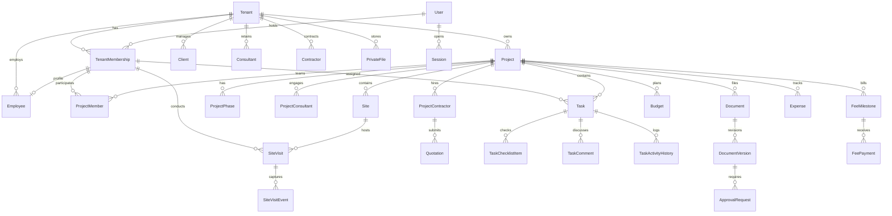

# Entity-Relationship Diagram & Data Model
**100% DESIGN Studio — Multi-Tenant Architecture Project Management Platform**

## Entity Catalog & Key Constraints

1. **Tenant**: Organization root entity. Normalized unique slug.
2. **User**: Global identity with email, password hash, and MFA flags.
3. **TenantMembership**: Role-based access control inside a tenant. Roles: `OWNER`, `ADMIN`, `PROJECT_MANAGER`, `EMPLOYEE`.
4. **Employee**: Unique employee profile scoped to tenant: `@@unique([tenantId, employeeId])`.
5. **Project**: Central project record: `@@unique([tenantId, code])`.
6. **ProjectPhase**: Phases in architectural sequence (Brief -> Concept -> Detailed Design -> 3D -> Working Drawings -> BOQ -> Sanctioning -> Execution -> Handover).
7. **Task**: Workflow states: `NOT_STARTED -> IN_PROGRESS -> IN_REVIEW -> COMPLETED`. Also supports `BLOCKED` and `CANCELLED`.
8. **SiteVisit & SiteVisitEvent**: Field visit scheduling, check-in/out snapshots, distance calculation, geofence evaluation (`WITHIN_RADIUS`, `OUTSIDE_RADIUS`, `UNCERTAIN`, `LOCATION_UNAVAILABLE`).
9. **Document & DocumentVersion**: Exact drawing revision tracking with approval isolation.
10. **Quotations & Finance**: Contractor quotations per project; budgets, fee milestones, fee payments, and verified expenses with explicit decimal types.
